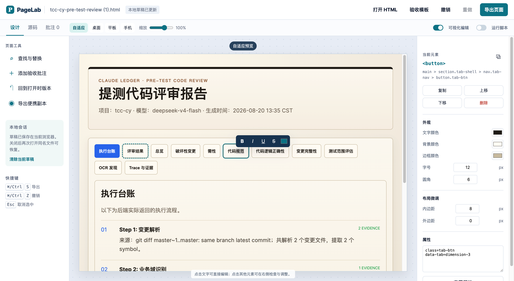
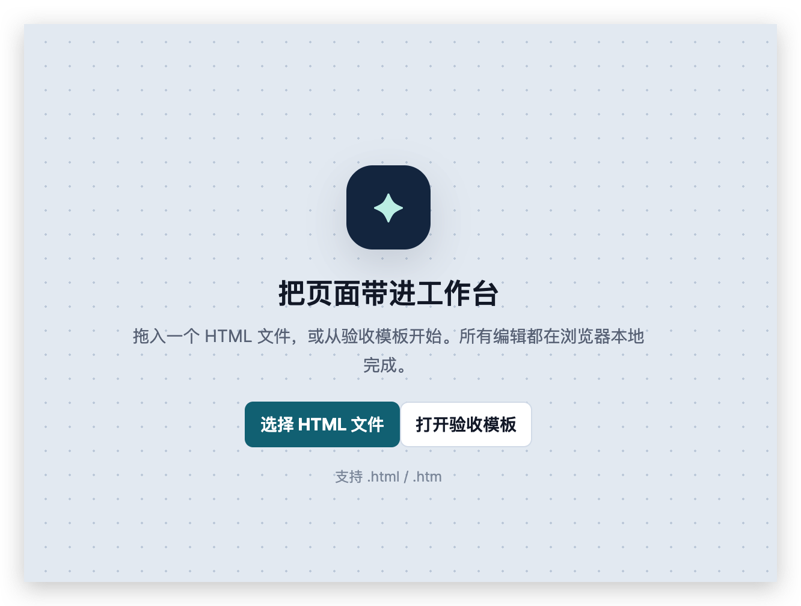
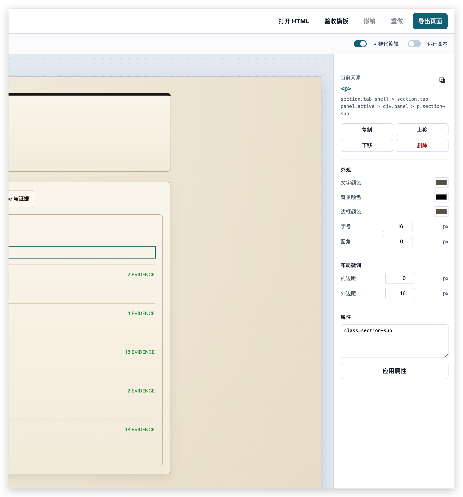
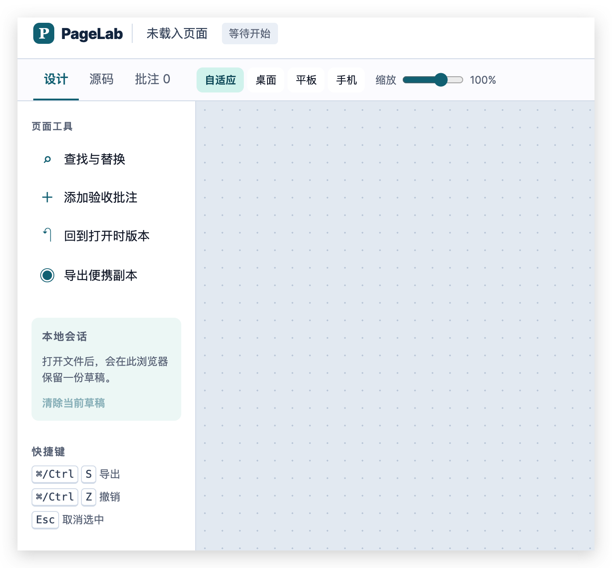

# PageLab

PageLab 是一个零依赖、本地运行的 HTML 页面工作台。把 `.html` 或 `.htm` 文件拖进浏览器后，可以直接改文字和按钮名，检查元素属性，在不同宽度下预览，并导出修改后的 HTML。

它适合处理报告验收页、原型评审稿、离线演示页和临时交付页面；不替代正式项目的源码管理、构建和发布流程。

## 截图

### 页面编辑与按钮文案

点击普通文本或按钮文案即可原位修改。编辑状态会拦截链接和按钮的原始点击，避免操作时跳转页面。



### 首次打开

可以选择本地 HTML 文件，也可以先打开内置的验收模板。



### 元素检查与响应式预览

选中元素后，可查看标签、CSS 路径和属性，并调整常用样式；画布可切换桌面、平板、手机预览尺寸。



### 宽屏工作区

工作区在没有导入文件时保持空白，避免将示例内容和实际文件混在一起。



## 适用人员和场景

- 测试人员：改验收页面文案、记录 P1/P2/P3 问题、导出批注。
- 产品人员：在评审前替换标题、说明、按钮名称，查看不同屏幕宽度下的布局。
- 开发人员：快速检查一个独立 HTML 文件的内容、属性与视觉样式，再把结果导出给相关同学确认。
- 演示或交付人员：在没有后端和构建环境时，临时维护一份可以离线打开的页面。

## 功能

### 导入、预览与编辑

- 点击选择或拖入 `.html` / `.htm` 文件。
- 内置“登录流程验收页”模板，方便先了解操作方式。
- 默认使用静态安全预览；导入页面中的 JavaScript 不会运行。
- 对可信文件可开启“运行脚本”。开启后可视化编辑会自动关闭。
- 在设计模式中点击正文、标题、说明或按钮文案即可编辑；按钮和链接不会执行原有动作。
- 支持自适应、1280px、768px、390px 四种预览宽度，以及 60% 至 120% 的画布缩放。

### 元素与文本调整

- 选中元素后显示标签名、CSS 路径、非样式属性和计算后的常用样式。
- 可调整文字颜色、背景色、边框色、字号、圆角、内外边距等样式。
- 可编辑元素属性，例如 `href`、`id`、`class`、`aria-label`。
- 支持复制、上移、下移、删除选中的元素。
- 选中文字后可设置粗体、斜体、下划线、删除线和文字颜色。
- 提供查找、定位和全部替换。

### 验收记录与导出

- 针对当前选中元素添加 P1、P2、P3 批注，记录内容会带上元素选择器和创建时间。
- 批注可单独导出为 JSON。
- 支持设计模式与源码模式切换。
- 支持撤销、重做和回到刚打开时的源版本。
- 常规导出生成 `-edited.html`；“便携副本”会尝试把可读取的图片转为 Data URL。

## 快速开始

克隆仓库后，直接双击打开 `index.html` 即可。若浏览器对本地文件有限制，可启动一个静态服务器：

```bash
git clone https://github.com/xsoway/editor-html.git
cd editor-html/page-lab
python3 -m http.server 4173
```

然后访问 <http://localhost:4173>。

## 操作说明

1. 点击“打开 HTML”，或把文件拖到页面中间的画布区域。
2. 在顶部选择“可视化编辑”；点击文字或按钮名后直接输入，按 `Esc` 或点击其他位置保存。
3. 点击页面中的区块，在右侧检查器中调整样式、属性，或使用复制、上下移动、删除操作。
4. 点击顶部的桌面、平板、手机切换预览宽度；拖动“缩放”查看细节。
5. 选中有问题的元素，点击“添加验收批注”，选择优先级并填写说明；需要转交时导出 JSON。
6. 使用“查找替换”批量处理重复文案；需要直接检查文件时切到“源码模式”。
7. 点击“导出页面”下载修改后的 HTML。若页面图片可被浏览器读取，可选择导出便携副本。

## 草稿与数据保存

修改会保存到当前浏览器的 `localStorage`，不会发送到服务器。再次导入同名且原始内容一致的文件时，PageLab 会提示是否恢复草稿。

“清除本地草稿”只删除当前浏览器中的该草稿；“回到源版本”恢复本次打开时的 HTML 内容和批注状态。两者都不会改写用户磁盘上的原始文件。

## 安全说明与限制

- 默认预览不执行导入文件中的 JavaScript。只有确认文件可信时，才应开启“运行脚本”。
- 开启脚本预览时，编辑功能不可用；这是为了避免页面自身脚本和编辑事件互相影响。
- 便携副本的图片内嵌依赖浏览器读取图片数据。跨域图片或被访问策略拦截的图片会保留原始地址。
- PageLab 面向单个 HTML 文件的临时编辑与审阅，不解析项目构建配置、模块依赖或服务端渲染结果。
- 正式页面仍应在项目源码中修改，并通过 Git、测试和发布流程交付。

## 快捷键

| 快捷键 | 操作 |
| --- | --- |
| `Cmd/Ctrl + S` | 导出当前页面 |
| `Cmd/Ctrl + Z` | 撤销 |
| `Cmd/Ctrl + Y` | 重做 |
| `Esc` | 结束文字编辑或取消元素选中 |

## 项目结构

```text
.
├── assets/
│   └── screenshots/  # README 截图
├── index.html        # 工作台结构与控件
├── app.js            # 导入、预览、编辑、草稿、批注、导出逻辑
├── styles.css         # 页面布局和视觉样式
├── state.css          # 组件状态样式
└── LICENSE            # MIT License
```

## 开发

项目不依赖 Node.js、构建工具或第三方包。修改 `index.html`、`app.js`、`styles.css` 或 `state.css` 后，刷新浏览器即可查看结果。

提交改动前，建议至少检查：导入文件、文字编辑、按钮文案编辑、导出页面和本地草稿恢复这几条操作。

## License

[MIT](LICENSE)
